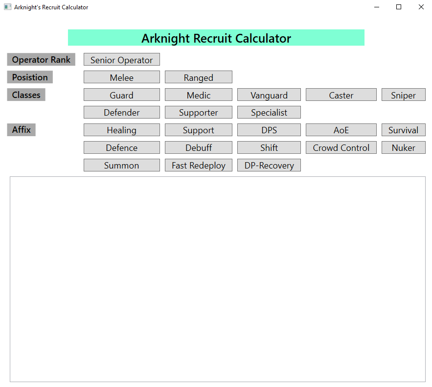
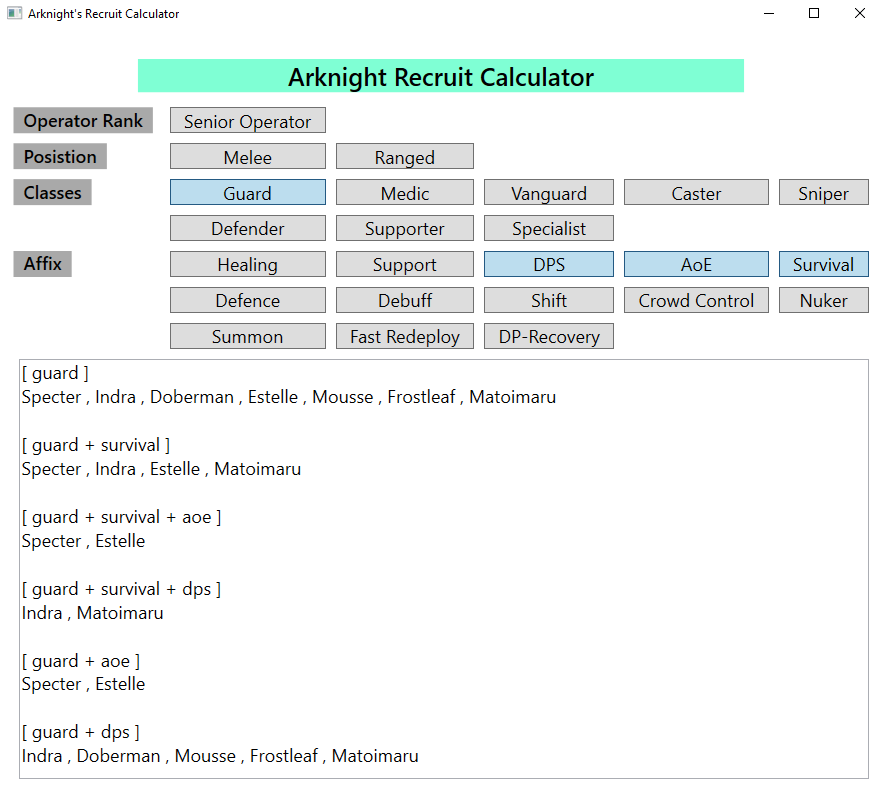

# Arknight_Recruit_Calculator

An application to predict possible character outcome using Arknight's Recruitment system.

## How to Install

* Download 'Arknight Recruit Calculator.zip' and extract folder to a location you wish to keep the application.
* Run the .exe file, 'Arknight_Recruit_Calculator.exe'. 
	* If you do not have .NET Framework Runtime installed, you will be prompted to install it.
	* Following hyperlink should direct you to Microsoft's .NET Framework download website (Download latest .NET Framework Runtime): https://dotnet.microsoft.com/download
  
## Using the Application

	

* Click the coressponding tags you have in the game to see possible character outcomes.
  * The application will compare at most 3 tags simultaneously. (i.e. Guard, Aoe, Survival and DPS tags were selected. Only a  maximum combination of 3 tags will be shown at a time with the fourth tag compared afterwards)
	

	

* You will see the characters possible to recruit in the textbox below.
	
## Credit

This application was made to figure out all possible outcome of given tags. Ideally the app would be used to pinpoint a desired character down. The application was built with an MVVM model in mind for future functionality implementation. Please feel free to take the code and edit it to your own liking. 

Thank you!
